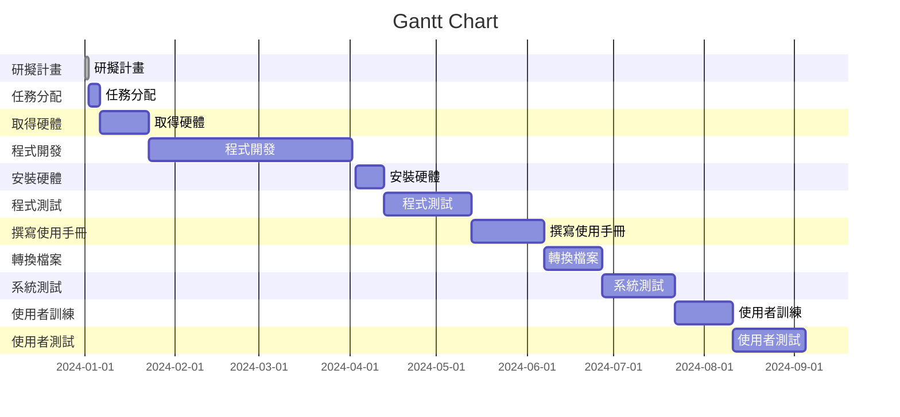

```mermaid
gantt
    title Gantt Chart
    dateFormat  YYYY-MM-DD
    section 研擬計畫
    研擬計畫 :done, 1, 2024-01-01, 1d
    section 任務分配
    任務分配 :2, 2024-01-02, 4d
    section 取得硬體
    取得硬體 :3, 2024-01-06, 17d
    section 程式開發
    程式開發 :4, 2024-01-23, 70d
    section 安裝硬體
    安裝硬體 :5, 2024-04-03, 10d
    section 程式測試
    程式測試 :6, 2024-04-13, 30d
    section 撰寫使用手冊
    撰寫使用手冊 :7, 2024-05-13, 25d
    section 轉換檔案
    轉換檔案 :8, 2024-06-07, 20d
    section 系統測試
    系統測試 :9, 2024-06-27, 25d
    section 使用者訓練
    使用者訓練 :10, 2024-07-22, 20d
    section 使用者測試
    使用者測試 :11, 2024-08-11, 25d
```
