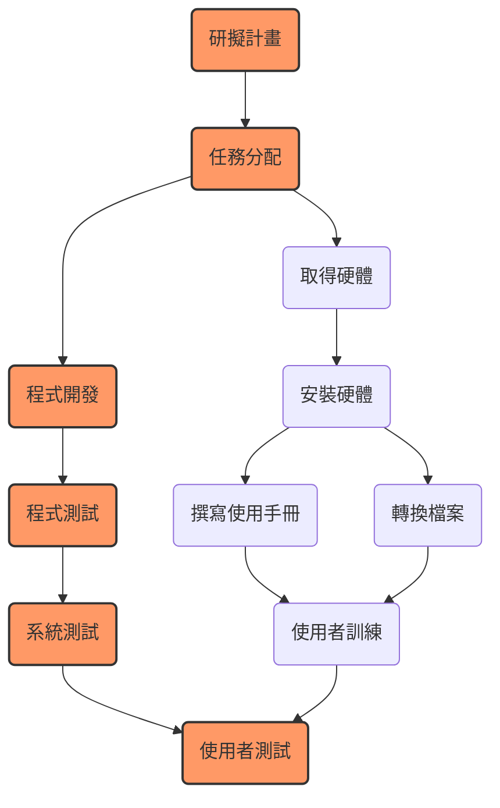

```mermaid
flowchart TD
    %% 定義任務和路徑
    A1(研擬計畫) --> A2(任務分配)
    A2 --> A3(取得硬體)
    A2 --> A4(程式開發)
    A3 --> A5(安裝硬體)
    A4 --> A6(程式測試)
    A5 --> A7(撰寫使用手冊)
    A5 --> A8(轉換檔案)
    A6 --> A9(系統測試)
    A7 --> A10(使用者訓練)
    A8 --> A10
    A9 --> A11(使用者測試)
    A10 --> A11

    %% 使用樣式標記關鍵路徑
    style A1 fill:#f96,stroke:#333,stroke-width:2px
    style A2 fill:#f96,stroke:#333,stroke-width:2px
    style A4 fill:#f96,stroke:#333,stroke-width:2px
    style A6 fill:#f96,stroke:#333,stroke-width:2px
    style A9 fill:#f96,stroke:#333,stroke-width:2px
    style A11 fill:#f96,stroke:#333,stroke-width:2px
```
