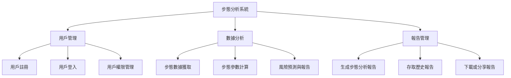

## FDD圖

```mermaid
graph TD
    A[步態分析系統]

    A --> B[用戶管理]
    A --> C[數據分析]
    A --> D[報告管理]

    B --> B1[用戶註冊]
    B --> B2[用戶登入]
    B --> B3[用戶權限管理]

    C --> C1[步態數據獲取]
    C --> C2[步態參數計算]
    C --> C3[風險預測與報告]

    D --> D1[生成步態分析報告]
    D --> D2[存取歷史報告]
    D --> D3[下載或分享報告]
```
