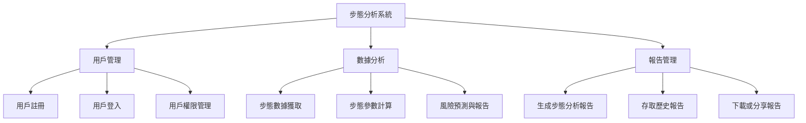

## FDD圖

---

## 1. 功能分解圖 (Functional Decomposition Diagram, FDD)

### 預設的功能分解圖
- **使用者管理**
  - 用戶註冊
  - 用戶登入
  - 用戶權限管理

- **數據分析**
  - 步態數據獲取
  - 步態參數計算
  - 風險預測與報告

- **報告管理**
  - 生成步態分析報告
  - 存取歷史報告
  - 報告下載或分享功能

---

## 2. 功能性需求與非功能性需求

### 功能性需求 (Functional Requirements)
1. **用戶註冊與登入功能**
   - 允許用戶註冊新帳戶，並提供登入功能以驗證用戶身分。

2. **即時步態參數分析**
   - 系統應提供即時的步態參數分析，並顯示結果供醫療人員和患者參考。

3. **病情風險預測**
   - 基於步態分析，系統提供風險預測，如肌少症、跌倒風險、平衡問題等，以支援醫療決策。

### 非功能性需求 (Non-Functional Requirements)
1. **系統可用性**
   - 系統應支援24/7可用性，確保醫療人員可隨時存取分析結果。

2. **資料隱私性**
   - 遵循醫療數據隱私法規，確保病患的個人資料與醫療資料的保密性。

3. **系統效能**
   - 即時處理步態分析，分析過程應在數秒內完成，以達成良好的用戶體驗。

---

## 3. 使用案例圖 (Use Case Diagram) 與 使用案例說明

### 使用案例圖
#### 主要角色與關係：
- **角色**
  - **用戶**：註冊與登入系統、瀏覽步態分析結果
  - **醫療人員**：查詢患者步態數據、瀏覽風險預測
  - **系統管理員**：管理用戶權限、維護數據庫
