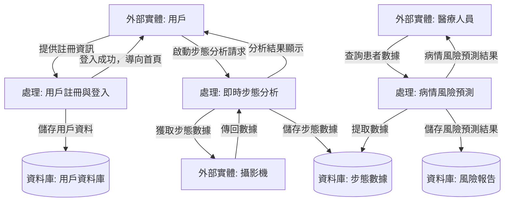

```mermaid
flowchart TD
    %% 外部實體與處理
    User[外部實體: 用戶] -->|提供註冊資訊| Process1[處理: 用戶註冊與登入]
    Process1 -->|儲存用戶資料| DataStore1[(資料庫: 用戶資料庫)]
    Process1 -->|登入成功，導向首頁| User

    User -->|啟動步態分析請求| Process2[處理: 即時步態分析]
    Process2 -->|獲取步態數據| Camera[外部實體: 攝影機]
    Camera -->|傳回數據| Process2
    Process2 -->|分析結果顯示| User
    Process2 -->|儲存步態數據| DataStore2[(資料庫: 步態數據)]

    MedicalStaff[外部實體: 醫療人員] -->|查詢患者數據| Process3[處理: 病情風險預測]
    Process3 -->|提取數據| DataStore2
    Process3 -->|病情風險預測結果| MedicalStaff
    Process3 -->|儲存風險預測結果| DataStore3[(資料庫: 風險報告)]
```
