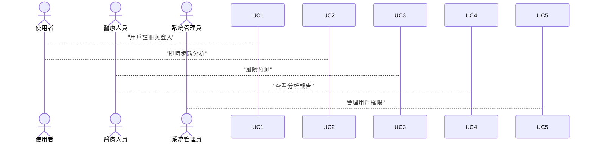

```mermaid
%% 使用案例圖的範例
%%{init: {'theme': 'default'}}%%
sequenceDiagram
    actor User as 使用者
    actor MedicalStaff as 醫療人員
    actor Admin as 系統管理員

    User-->UC1: "用戶註冊與登入"
    User-->UC2: "即時步態分析"
    MedicalStaff-->UC3: "風險預測"
    MedicalStaff-->UC4: "查看分析報告"
    Admin-->UC5: "管理用戶權限"
```
