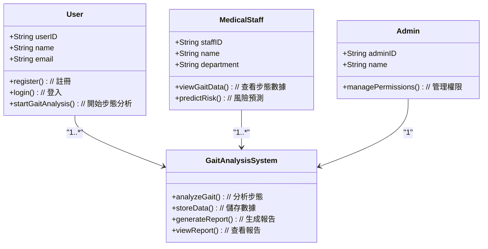
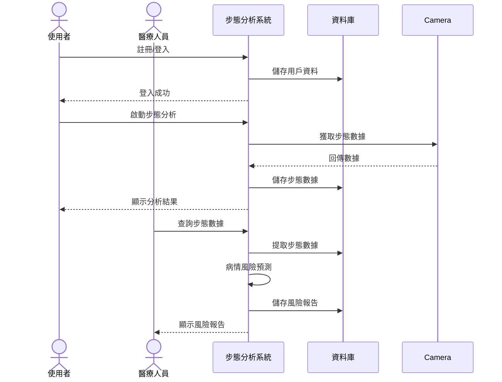
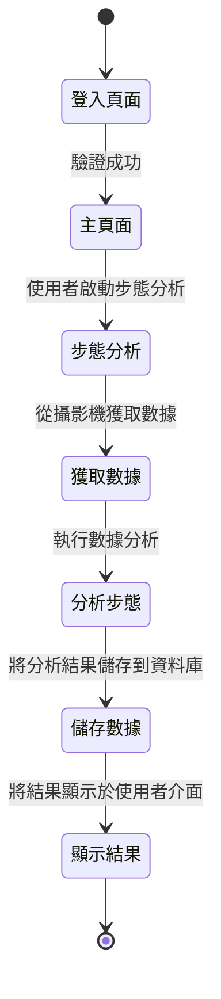

## 1. UML類別圖

```mermaid
classDiagram
    class User {
        +String userID
        +String name
        +String email
        +register() // 註冊
        +login() // 登入
        +startGaitAnalysis() // 開始步態分析
    }

    class MedicalStaff {
        +String staffID
        +String name
        +String department
        +viewGaitData() // 查看步態數據
        +predictRisk() // 風險預測
    }

    class Admin {
        +String adminID
        +String name
        +managePermissions() // 管理權限
    }

    class GaitAnalysisSystem {
        +analyzeGait() // 分析步態
        +storeData() // 儲存數據
        +generateReport() // 生成報告
        +viewReport() // 查看報告
    }

    User --> GaitAnalysisSystem : "1..*"
    MedicalStaff --> GaitAnalysisSystem : "1..*"
    Admin --> GaitAnalysisSystem : "1"
```

---

## 2. 循環圖

```mermaid
sequenceDiagram
    actor User as 使用者
    actor MedicalStaff as 醫療人員
    participant GaitAnalysisSystem as 步態分析系統
    participant DataStore as 資料庫

    User ->> GaitAnalysisSystem: 註冊/登入
    GaitAnalysisSystem ->> DataStore: 儲存用戶資料
    GaitAnalysisSystem -->> User: 登入成功

    User ->> GaitAnalysisSystem: 啟動步態分析
    GaitAnalysisSystem ->> Camera: 獲取步態數據
    Camera -->> GaitAnalysisSystem: 回傳數據
    GaitAnalysisSystem ->> DataStore: 儲存步態數據
    GaitAnalysisSystem -->> User: 顯示分析結果

    MedicalStaff ->> GaitAnalysisSystem: 查詢步態數據
    GaitAnalysisSystem ->> DataStore: 提取步態數據
    GaitAnalysisSystem ->> GaitAnalysisSystem: 病情風險預測
    GaitAnalysisSystem ->> DataStore: 儲存風險報告
    GaitAnalysisSystem -->> MedicalStaff: 顯示風險報告
```

---

## 3. 活動圖

```mermaid
stateDiagram
    [*] --> 登入頁面
    登入頁面 --> 主頁面 : 驗證成功
    主頁面 --> 步態分析 : 使用者啟動步態分析
    步態分析 --> 獲取數據 : 從攝影機獲取數據
    獲取數據 --> 分析步態 : 執行數據分析
    分析步態 --> 儲存數據 : 將分析結果儲存到資料庫
    儲存數據 --> 顯示結果 : 將結果顯示於使用者介面
    顯示結果 --> [*]
```

